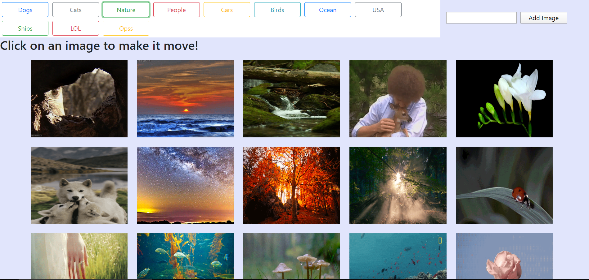

# Search-Images

## Overview
Web Application that uses the `GIPHY API` to make a dynamic web page that populates with gifs of user choice.

## Getting Started
These instructions will get you a copy of the project up and running on your local machine.

### Installing
Git clone the repository to your local machine:

HTTPS:
```
https://github.com/AmjedAyoub/Search-Images.git
```
SSH:
```
git@github.com:AmjedAyoub/Search-Images.git
```

## Screen-shots

### Home Page


## Technologies & Tools
* HTML  
* CSS
* JavaScript

## Links
This application is deployed on GitHub Pages, [Try it yourself](https://amjedayoub.github.io/Search-Images).\
This application is published on [GitHub](https://github.com/AmjedAyoub/Search-Images).

## Authors
See contribution history [here](https://github.com/AmjedAyoub/Search-Images/graphs/contributors).